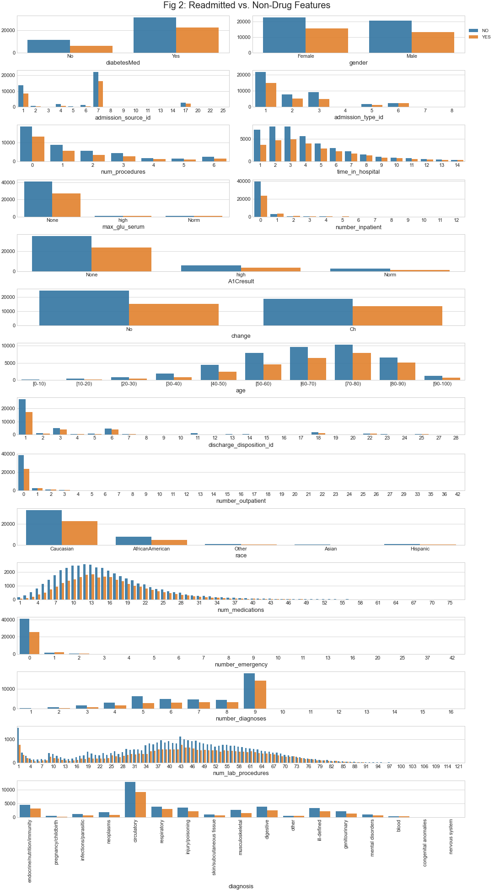
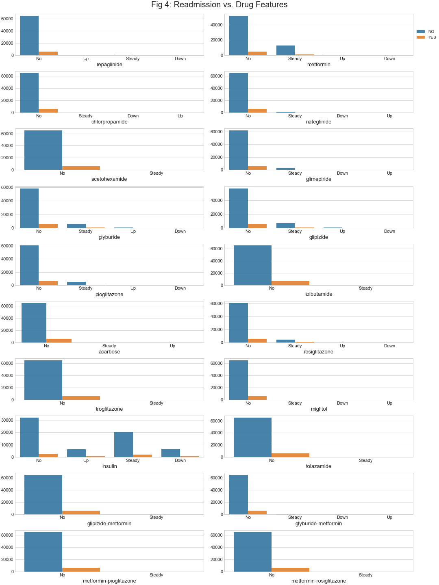
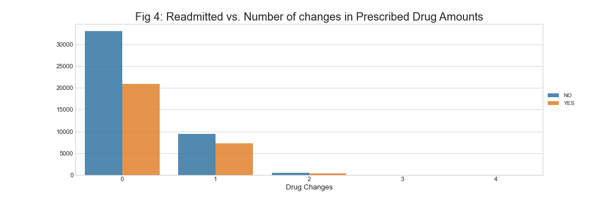
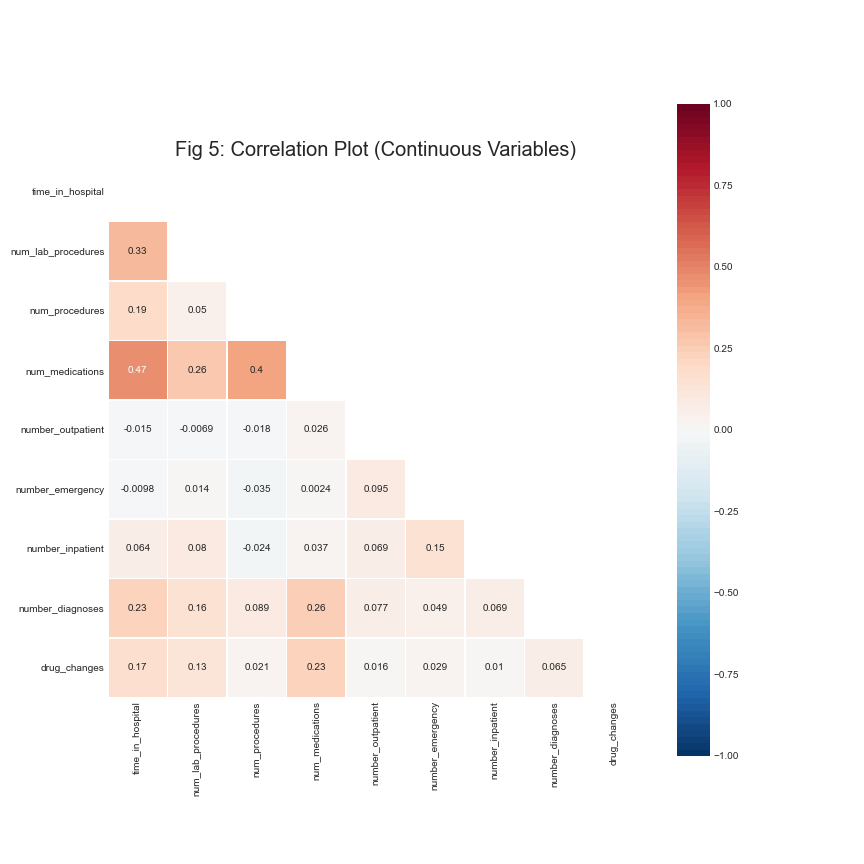
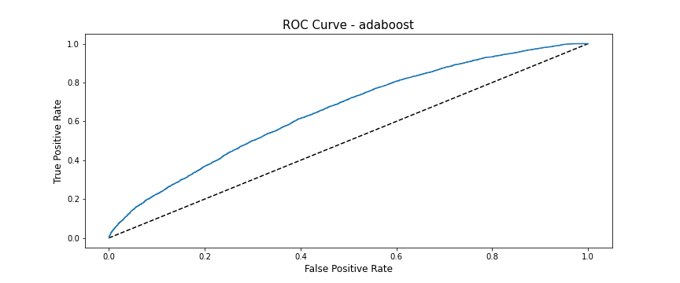
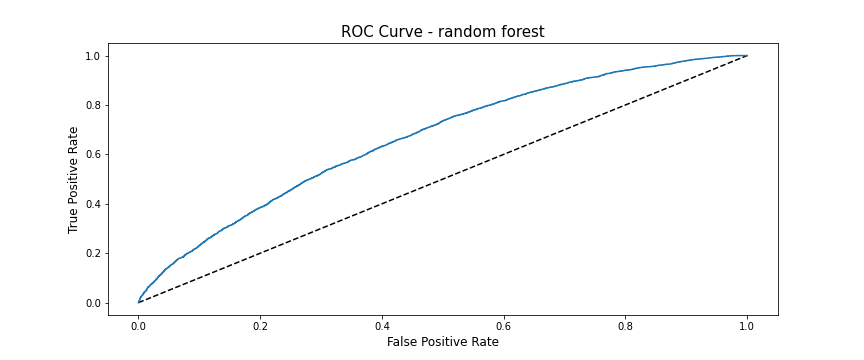
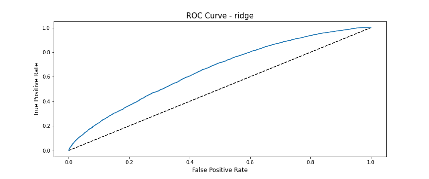
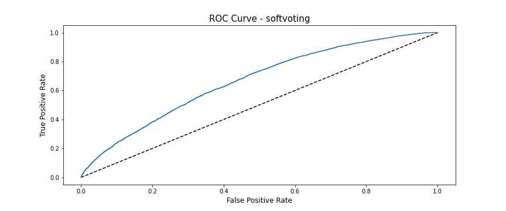

# Predicting Hospital Readmission

December 27, 2020

Alexander Lindsey

## Background

In this investigation, I use the data collected in [Strack et. al. (2014)](https://www.hindawi.com/journals/bmri/2014/781670/) to predict the readmission of patients admitted to a hospital or integrated delivery network in the United States from 1999-2008. The data contains 101,766 hospital visits for 71,518 unique patients. The dataset contains patient information, such as their race, gender, and age, alongside variables relating to the nature of their admission to the hospital, such as their diagnoses, time in hospital, test results, etc.

## Problem

A readmission occurs when a patient has been readmitted to the hospital within 30 days of an earlier hospital stay. The economic cost of hospital readmissions is considerably large - readmission of elderly patients costs the federal health insurer, Medicare, approximately [$15 billion dollars per year](https://www.healthstream.com/resources/blog/blog/2020/06/02/the-economic-emotional-cost-of-hospital-readmissions#:~:text=The%20cost%20of%20hospital%20readmissions,the%20program%20received%20readmissions%20penalties.).

The Center for Medicare & Medicaid Services (CMS) penalizes hospitals for patient readmission, reducing hospital revenue. Additionally, patients and their families suffer an emotional, physical, and financial toll when they are readmitted. 

Models similair to the one(s) created in this investigation could be used by hospitals and medical insurers to predict hospital readmission, driving down costs. 

## Goal

The goal of this investigation is to create a classification model using supervised machine learning that predicts if a patient will be readmitted or not. Models are optimized for accuracy, where: 

accuracy= (TP + TN) / total

Where:
- TP = True Positive
- TN = True Negative

Readmission is defined, for the purposes of this specific analysis, as _any readmission_ after the original admission to the hospital (e.g., the patient would count as reamitted if they were readmitted after 30 days). This is because the incidence rate of <30 day readmission is extremely low in this dataset.

## Data Description

One problem with this dataset is that there are _a lot_ of categorical features - one-hot encoding the dataset with minimal feature engineering results in over 2,500 columns. While this may also impact model accuracy, training models with so many columns and tens of thousands of observations is very computationally intensive and therefore impractical. 

Below is a list of features and their descriptions. 
- `encounter_id`: Unique identifier of an encounter.
- `patient_nbr`: Unique identifier of a patient.
- `race`: Caucasian, Asian, African American, Hispanic, and other.
- `gender`: male, female, and unknown/invalid.
- `age`: Grouped in 10-year intervals: 0, 10), 10, 20), …, 90, 100).
- `weight`: Weight in pounds.
- `admission_type_id`: Integer identifier corresponding to 9 distinct values, for example, emergency, urgent, elective, newborn, and not available.
- `discharge_disposition_id`: Integer identifier corresponding to 29 distinct values, for example, discharged to home, expired, and not available.
- `admission source_id`: Integer identifier corresponding to 21 distinct values, for example, physician referral, emergency room, and transfer from a hospital.
- `time_in_hospital`: Integer number of days between admission and discharge.
- `payer_code`: Integer identifier corresponding to 23 distinct values, for example, Blue Cross/Blue Shield, Medicare, and self-pay.
- `medical_specialty`: Integer identifier of a specialty of the admitting physician, corresponding to 84 distinct values, for example, cardiology, internal medicine, family/general practice, and surgeon.
- `num_lab_procedures`: Number of lab tests performed during the encounter.
- `numb_procedures`: Number of procedures (other than lab tests) performed during the encounter.
- `num_medications`: Number of distinct generic names administered during the encounter.
- `number_outpatient`: Number of outpatient visits of the patient in the year preceding the encounter.
- `number_emergency`: Number of emergency visits of the patient in the year preceding the encounter.
- `number_inpatient`: Number of inpatient visits of the patient in the year preceding the encounter.
- `diag_1`: The primary diagnosis (coded as first three digits of ICD9); 848 distinct values.
- `diag_2`: Secondary diagnosis (coded as first three digits of ICD9); 923 distinct values.
- `diag_3`: Additional secondary diagnosis (coded as first three digits of ICD9); 954 distinct values.
- `number_diagnoses`: Number of diagnoses entered to the system
- `max_glu_serum`: Indicates the range of the result or if the test was not taken. Values: “>200,” “>300,” “normal,” and “none” if not measured.
- `A1Cresult`: Indicates the range of the result or if the test was not taken. Values: “>8” if the result was greater than 8%, “>7” if the result was greater than 7% but less than 8%, “normal” if the result was less than 7%, and “none” if not measured.
- `change`: Indicates if there was a change in diabetic medications (either dosage or generic name). Values: “change” and “no change”.
- `diabetesMed`: Indicates if there was any diabetic medication prescribed. Values: "yes" and "no".
- 24 features for medications: Medications under their generic names: `metformin`, `repaglinide`, `nateglinide`, `chlorpropamide`, `glimepiride`, `acetohexamide`, `glipizide`, `glyburide`, `tolbutamide`, `pioglitazone`, `rosiglitazone`, `acarbose`, `miglitol`, `troglitazone`, `tolazamide`, `examide`, `sitagliptin`, `insulin`, `glyburide-metformin`, `glipizide-metformin`, `glimepiride-pioglitazone`, `metformin-rosiglitazone`, and `metformin- pioglitazone`. The feature indicates whether the drug was prescribed or there was a change in the dosage. _Values: up if the dosage was increased during the encounter, down if the dosage was decreased, steady if the dosage did not change, and no if the drug was not prescribed._
- `readmitted`: Days to inpatient readmission. Values: “<30” if the patient was readmitted in less than 30 days, “>30” if the patient was readmitted in more than 30 days, and “No” for no record of readmission

## Exploratory Analysis

**Warning**: If you have Github set to darkmode, turn off darkmode. 

### Readmission

As can be seen below, the prevalance of readmission in this dataset is low - likely a reflection of the fact that readmission is costly to care providers. A large majority of readmissions are >30 day readmission.


### Incidence of Features (Non-Drug) vs. Readmission

Figure 2, below, shows the incidence of each non-drug feature, broken down by readmission. 

Unfortunantly, the incidence rate of readmission is constant for each feature - no feature stands out that might play a major role in predicting readmission. However, there are a few patterns to note:
- The likelyhood of readmission increases with a change in diabetic medication.
- The likelyhood of readmission increases with age.
- The likelyhood of readmission increases was the number of medications increases, until the likelyhood starts to decrease. 
- The likelyhood of readmission increases with the number of diagnoses, spiking at 9 diagnoses. 
- The likelyhood of readmission increases with the number of lab procedures.

Note that the y-axis is the number of observations. 



### Incidence of Drug Features vs. Readmission

Figure 3 below shows the same as Figure 2 but for drug features. Unfortnately, no features stand out in its possible ability to explain the variance of readmission.



### Changes in Drug Regimen

In an effort to reduce dimensionality, changes in prescribed drug dosages are used instead of the drugs themselves. A composite metric, `drug_changes` is created. For each prescribed change in the dosage of a drug, whether it be increased or decreased, this metric increases by 1. Otherwise, it is not increased (i.e., someone with no changes in their prescribed drug dosages would have a `drug_changes` of 0).

Drug features are then dropped from modelling.



### Admission Type, Admission Source, Discharge Disposition
As seen in the `codes` dataframe, many of values in `admission_source_id`, `admission_type_id`, and `discharge_disposition_id` are very similair (i.e., `discharge_disposition_id` equal to 11, 19, 20 or 21 all indicated the patient expired). 

Similair values are therefore lumped together based on their definition in `codes`. 


### Correlation Matrix

Figure 5 below shows the correlation matrix for a continuous features. Notice that the number of procedures, number of medications, and time in hospital are all positively correlated, as one would expect. 

There is also a slighly positive correlation (0.15) with the number of days the patient was in the hospital the previous year, `number_inpatient`. 

A correlation matrix on the entire one-hot encoded dataset is not shown as it has too meany features and is difficult to ascertain the relationships.



## Modelling & Hyperparameter Optimization

The data is scaled, one hot encoded, and split into training and test sets where 80% of the data is used for training. This means the training set is comprised of 57,214 observations, while the test set is 14,304 observations.

A baseline model, predicting no readmission, has an accuracy of 59.86%. 

Several models are trained using `RandomizedSearchCV` and `GridSearchCV`. I use 5-fold cross validation to select the combination of hyperparameters that maximizes accuracy on the out-of-fold prediction. The following models are used:
- Ridge Regression
- Stochastic Gradient Descent (SGD) Classifier
- Random Forest Classifier
- Adaboost Classifier using Decision Trees with a depth of 1
- Hardvoting Classifier
- Softvoting Classifier

If a hospital were to use a similar model in a production setting, they may optimize for precision or recall depending on the weight they put on false negatives or positives.

Logistic regression with lasso regularization was also used, but had trouble converging in a reasonable amount of time (<5 minutes). Other classifiers, such as K-Nearest Neighbors and Support Vector Machines are unreasonable for this many attributes.

## Results

Models, their accuracy on the test set, and their hyperparameters are stored in `Models.csv`. 

The Random Forest performs best in Out-of-Fold predictions, with an accuracy of 63.70%, an improvement over baseline of 3.84%.

Assessing accuracy using the test set, the Sofvoting Classifier performs best with an accuracy of 63.39%, an improvment of 3.53%.

Below are precision, recall, and F1 score for the Softvoting Classifier, where:

precision = TP / (TP + FP)

recall = TP / (TP + FN)

F1 = 2 * (precision / (precision * recall))

Where:
- FP = False Positives
- FN = False Negatives


Below are ROC curves for each model with a `.predict_proba_` method - the dotted line represents a totally random model, and so curves farther away from the model are better. 







## Conslusion

### Further Investigations

There are two areas where further investigation is warranted:
1. Perhaps a neural network can better predict readmission using this data.
2. A more thoughtful feature selection, such as Principal Component Analysis (PCA), may lead to improved results. Due to the quantity of features in this dataset, feature selection is extremely important. Through the feature selection above, I may have erroded a large portion of explained variability in this data.
    
    I believe this to be unlikely as there were no features that stood out in figures 2 and 3 - each orange bar is approximately 75% of the adjacent blue bar, which is proportional to the occurence rate of readmission. Thus, no feature stands out in its ability to explain the variance in readmission. Using PCA, it _may_ be possible to reduce the feature space to a manageable size without erroding too much explaiend variance in readmission. Unfortunantly, I do not think much of the variance in readmission is explained in this dataset (i.e., there are other unknown variables that dramatically impact readmission), and so PCA would likely not be particularly useful. 


#### Redefining Readmission
The present analysis defines readmission as a patient revisiting the hospital whether it be less than or greater than 30 days after their original admission. Hospitals are likely more concerned about readmission within 30 days, but these models do not perform will when using this definition. To see model performance, in `preprocessing.py`, simply change line 33 such that:

```python
df['readmitted'].replace({'<30':'YES', '>30':'NO'}, inplace=True)
```

<script type="text/javascript" async
src="https://cdn.mathjax.org/mathjax/latest/MathJax.js?config=TeX-MML-AM_CHTML">